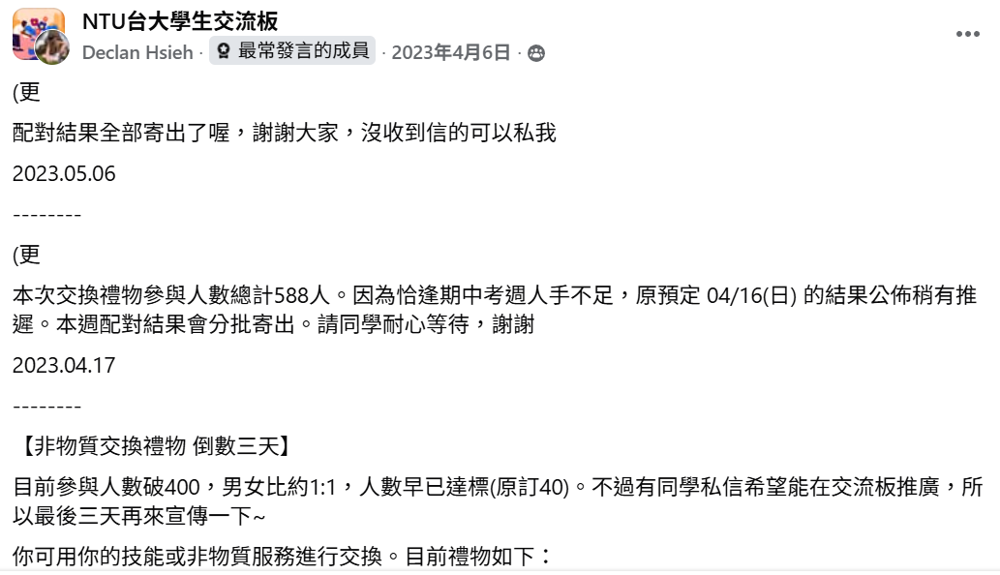
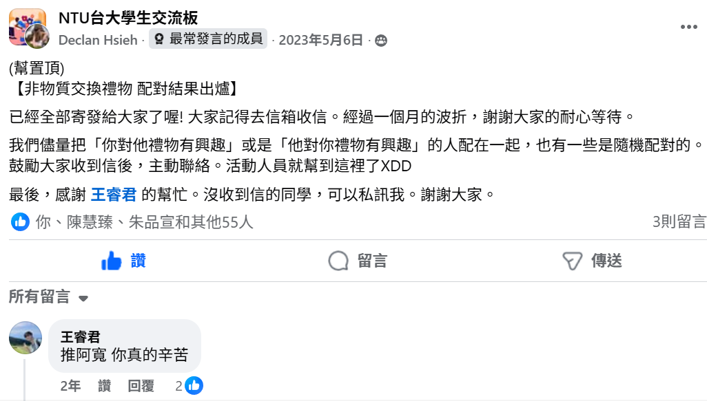

# Non-Material Gift Exchange Automator (非物質交換禮物自動化系統)


## 🎁 專案緣起 (The Story)

**時間：2023 年初**
**角色：自動化流程開發與資料處理 (Automation & Data Processing)**

這是一場由我和朋友共同發起的校園實驗——**「非物質交換禮物」**。
不同於傳統的物質交換，我們鼓勵參與者提供自己的 **「興趣、技能、陪伴」** 甚至是 **「私房美食清單」** 作為禮物，試圖在校園中建立更深層的連結。

**團隊分工：**
* **合作夥伴**：負責社群行銷、文案撰寫與活動推廣，成功在校園網站上吸引了 **488 位參與者**。
* **我 (本專案作者)**：負責 **技術支援**，包含清洗原始報名資料、編寫配對邏輯，以及開發自動化程式來處理大規模的信件發送。

---

## 🚀 專案效益 (Impact)
> **"From 1 Week to 2 Hours"**

由於配對結果包含高度客製化的資訊（每個人收到的禮物內容、對方聯絡方式皆不同），人工處理極其耗時。

* **Before (人工處理)**：若要手動整理 488 人的名單並逐一撰寫客製化信件，預計需耗費 **1 個工作週 (約 40 小時)**，且極易因疲勞產生人為錯誤。
* **After (自動化工具)**：我開發了 Python 腳本串接 Gmail SMTP，僅需 **2 小時** (含資料整理與程式執行時間) 即可完成全數發送。
* **Result**：效率提升超過 **20 倍**，並確保 488 封客製化信件零失誤送達。

---

## 📸 活動回顧與技術成果 (Gallery)

### 1. 活動發起與迴響
活動在校園社群平台引發熱烈討論，證明了非物質交流的需求。
<p float="left">
  
   
</p>

### 2. 自動化寄信成果
程式根據 Excel 中的配對 ID，自動抓取對應夥伴的禮物內容與聯絡方式，生成獨一無二的通知信。
*(下圖個資部分已模糊處理)*


---

## 🛠️ 技術實作 (Tech Stack)
* **Python**: 核心邏輯。
* **OpenPyXL / Pandas**: 
    * 讀取表單回應資料 (Data Parsing)。
    * 處理重複報名與資料清洗 (Data Cleaning)。
    * 建立 ID 對應關係 (Mapping)。
* **Yagmail**: 簡化 SMTP 流程，實現批量且客製化的郵件發送。

---

## ⚙️ 環境設定與教學 (Setup Guide)

### 1. 取得 Google 應用程式密碼
由於 Google 安全性政策，一般帳號密碼無法直接用於程式寄信。你需要申請一組 **16 位數的應用程式專用密碼 (App Password)**。
* **教學連結**：[如何申請 Gmail SMTP 應用程式密碼 (參考教學)](https://www.ibest.com.tw/news-detail/gmail-smtp/)
* **注意**：申請完畢後，請妥善保存該組密碼，並填入程式設定中。

### 2. 執行程式
建議建立一個 `.env` 檔案來儲存密碼，或是直接修改 `src/main_mailer.py` 中的設定：

```python
# main_mailer.py
SENDER_EMAIL = "your_email@gmail.com"
SENDER_PASSWORD = "xxxx xxxx xxxx xxxx"  # 填入你的 16 位數應用程式密碼
